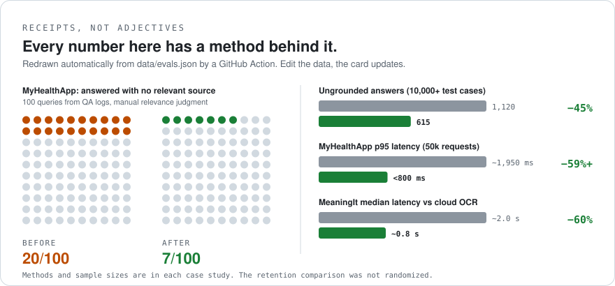

# Chirag Nadheria

**Full-Stack AI Engineer** · grounded RAG · on-device ML · evaluation-first

I build AI that answers from sources, or doesn't answer.

[Email](mailto:nadheriachirag@gmail.com) · [LinkedIn](https://www.linkedin.com/in/chirag-nadheria-b8bb76374) · **Open to Full-Stack AI Engineer roles** (India / remote)

<picture>
  <source media="(prefers-color-scheme: dark)" srcset="assets/grounding-report-dark.svg">
  
</picture>

---

## Release status

<!--START_SECTION:shipped-->
| Project | Latest release | Updated |
|---|---|---|
| [MeaningIt](https://github.com/chirag902/MeaningIt) | not released yet | 07 Oct 2026 |
| [My-Health-App](https://github.com/chirag902/My-Health-App) | not released yet | 07 Oct 2026 |
<!--END_SECTION:shipped-->

---

## Selected work

### [MyHealthApp](https://github.com/chirag902/My-Health-App) · grounded RAG health assistant
Health is the worst place for an LLM to guess. Every claim must trace to a retrieved source; if it can't, the app declines.

- **45% fewer** ungrounded answers (1,120 → 615 failures) across 10,000+ test cases
- **p95 latency ~1,950 ms → under 800 ms** (Locust, 50,000 requests, 100 concurrent users)
- **60% fewer** redundant API calls (200 → 80) over 30 days of logs

`Next.js` `Node.js` `Grok API` `vector search` `IndexedDB` `Firebase`  
**Status:** stabilizing for a public release, with known issues tracked in the repo · [Architecture & case study](https://github.com/chirag902/My-Health-App)  
Informational tool, not medical advice.

### [MeaningIt](https://github.com/chirag902/MeaningIt) · on-device OCR + speech translation
Scan text and speak in one flow, with recognition running on the device instead of a cloud round-trip.

- **60% faster** (median ~2.0 s → ~0.8 s vs. a cloud OCR baseline), 500+ runs per device on Pixel 5 and OnePlus Nord
- **Mode-switch drop-off 32% → 13%** (−19 points), Firebase Analytics funnel

`TypeScript` `Next.js` `Google ML Kit` `Firebase Cloud Messaging`  
**Status:** stabilizing for a public release, with known issues tracked in the repo · [Architecture & case study](https://github.com/chirag902/MeaningIt)

---

## How I work

- **Measure first.** Every number has a stated method and sample size. Small samples and non-randomized comparisons are labeled as such in the repos.
- **Document failures.** MyHealthApp answered 20 of 100 questions even when retrieval found nothing relevant. The test suite caught it, I added a hard grounding rule, and it dropped to 7 of 100.
- **Prefer refusing to guessing** when the cost of a wrong answer is high.

## Stack

**Languages:** TypeScript · JavaScript  
**Frontend:** React · Next.js · Tailwind CSS  
**Backend & data:** Node.js · Firebase · IndexedDB (offline-first sync)  
**AI:** LLM APIs · retrieval-augmented generation · on-device ML (Google ML Kit) · evaluation test suites  
**Quality:** Vitest · Locust load testing · GitHub Actions

---

<b>How this profile works</b>

The card above isn't a screenshot or a third-party widget. [`data/evals.json`](data/evals.json) holds the raw before/after numbers, [`scripts/render_report.py`](scripts/render_report.py) (standard-library Python, no dependencies) draws light and dark SVGs, and a [GitHub Action](.github/workflows/profile.yml) redraws it whenever the data changes. The "Release status" table is filled from my real GitHub Releases by [`scripts/sync_shipped.py`](scripts/sync_shipped.py). Percentages are computed from raw numbers, never typed by hand, and the bot only commits when something actually changed.

